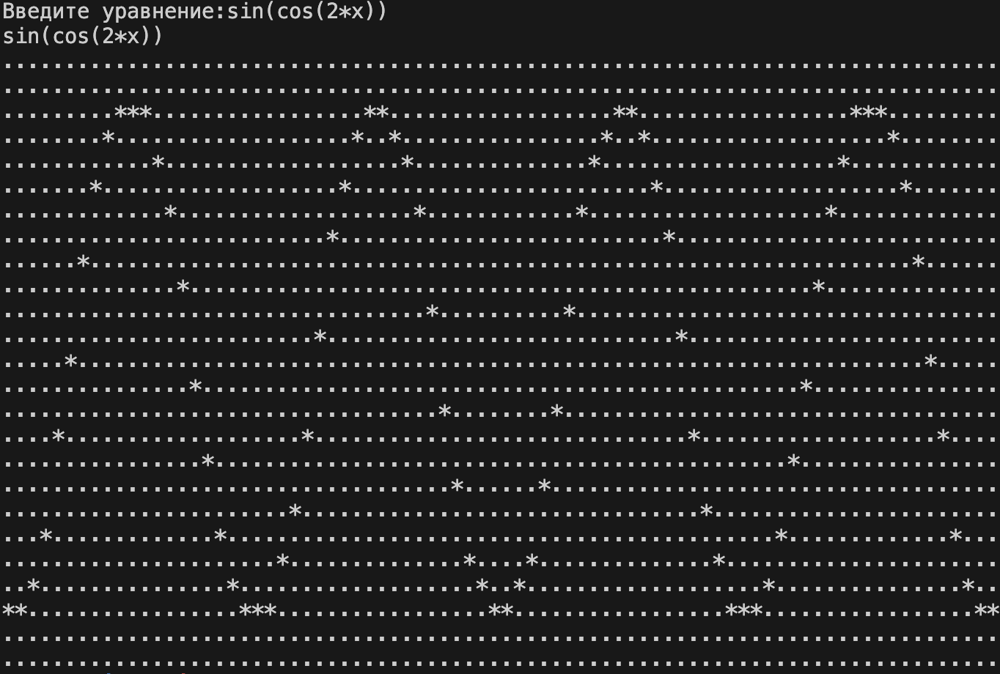
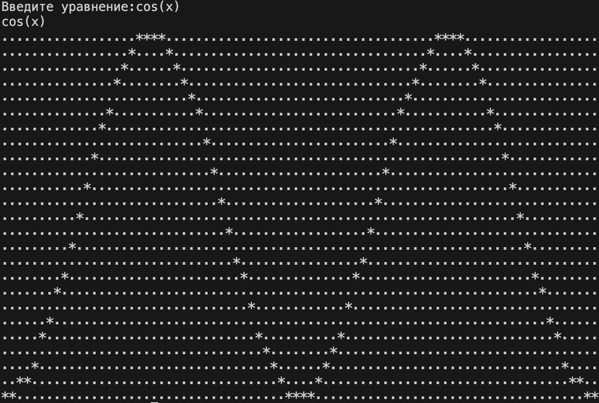

## 📈 📉 Plotter based on the Reverse Polish notation

### Calculation and plotting based on Reverse Polish notation
🚀 Developed in a structured programming style in pure C language.

🔦 Implemented Stack structures on arrays and singly linked lists




### 🏁 Start the Plotter

* To start the plotter - use `make` and after `make start`.

### ⚙️ It is possible to customize the programm
* The default size of the plot by Y [-1;1] (2.0) by X [-2Pi;2Pi] (4.0)

* You can change the range of plot by replacing the constants in the print.c
```c 
double x_step = 4.0 * M_PI / (WIDTH - 1);
double y_step = 2.0 / (HEIGHT - 1);
```
* Also you can change the size of window by replacing the macro in the print.c
```c
#define HEIGHT 25
#define WIDTH 80
```


### ℹ️ Examples of the equations of the graphs
sin(cos(2*x))
cos(x)
sin(cos(-2*x)) 
ln(-2x)
ln(2x)
sqrt(2x)
2/x
-1 + x
sin(x)*tan(x)+cos(3)
